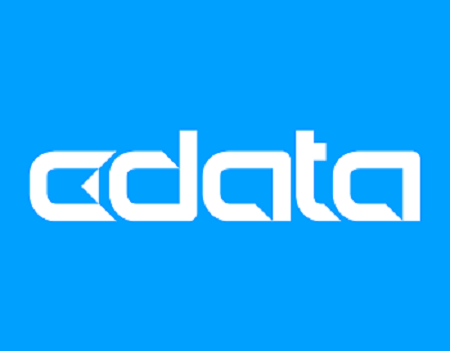
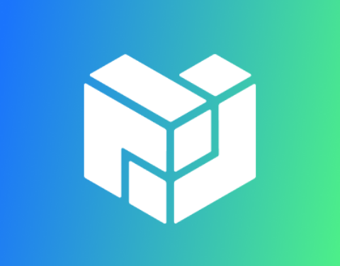
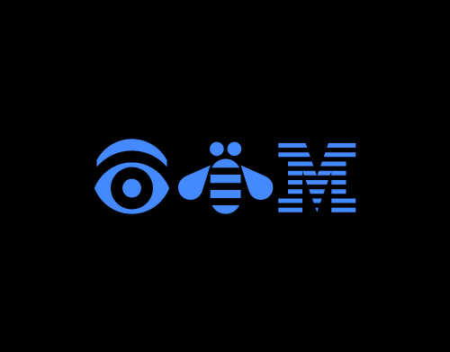

# Shawn Lindsey

## About

Technical Writer with experience documenting enterprise platforms, developer tooling, APIs, and scalable documentation systems. Experienced working in docs-as-code environments using Git, Markdown, structured authoring workflows, and AI-assisted tooling.

---

## Featured Projects

- [AI-Assisted Documentation Review Agent](./ai-documentation-agent)
- [MCP Server & Developer Tooling Documentation](./mcp-documentation)

---

## Selected Writing Samples

<h3>
  
  CData Software
</h3>

- [Introduction to MCP](https://cdn.cdata.com/help/FOK/mcp/pg_mcpintro.htm) - Developer onboarding and MCP workflow documentation
- [Creating a Custom OAuth Application](https://cdn.cdata.com/help/BBK/ado/pg_oauthcustomappcreate.htm) - OAuth configuration and authentication setup documentation
- [Data Hub vs. Data Lake vs. Data Warehouse](https://www.cdata.com/blog/data-hub-vs-data-lake-vs-data-warehouse) - Technical comparison article for enterprise data systems

<h3>
  
  Coinbase
</h3>

- [Launch a Participate Cluster](https://help.coinbase.com/en/cloud/participate/launch-cluster) - Cloud infrastructure onboarding documentation
- [Manage your Participate Cluster](https://help.coinbase.com/en/cloud/participate/manage-cluster) - Developer workflow and operational guidance
- [Wallet Quick Start](https://docs.cdp.coinbase.com/wallets/quickstart/user-auth) - Developer onboarding for embedded wallets

<h3>
  
  Protocol Labs
</h3>

- [Meet 3BoxLabs](https://www.protocol.ai/blog/meet-3box-labs-building-a-web-of-rust-with-data/) - Technical ecosystem and infrastructure storytelling
- [Pioneering the Future of Encrypted Data](https://protocol.ai/blog/meet-zama-pioneering-the-future-of-encrypted-data/) - Emerging technology and encryption-focused content

<h3>
  
  Rocket Software
</h3>

- [Rocket TE Web Administrator Guide](https://www3.rocketsoftware.com/bluezone/help/v101/en/bzweb/default.htm) - Enterprise administration and product documentation

<h3>
  
  IBM
</h3>

- [What’s New in Feature Pack 9](https://help.hcltechsw.com/domino/9.0.1/admin/admin/over_whats_new_in_fp9.html) - Product release and feature documentation
- [Disabling Inline View Indexing](https://help.hcltechsw.com/domino/9.0.1/admin/admin/admn_inline_index_disabling.html) - Administrative configuration documentation

---

## Writing Focus Areas

- Developer Documentation
- AI-Assisted Workflows
- Docs-as-Code Systems
- API & Integration Documentation
- Technical Content Operations
- Onboarding & Configuration Workflows
