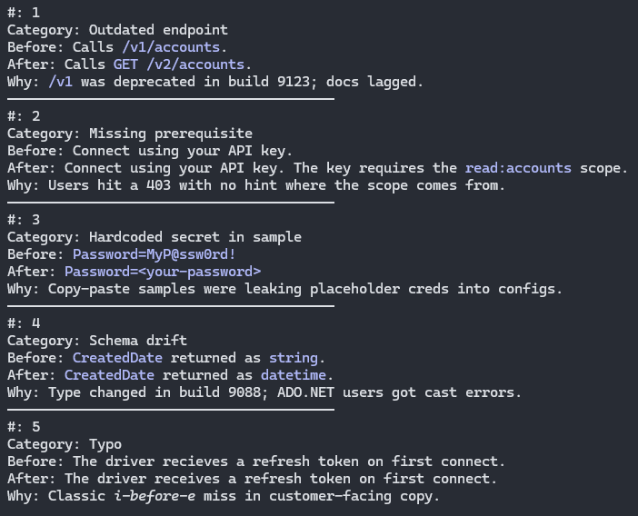
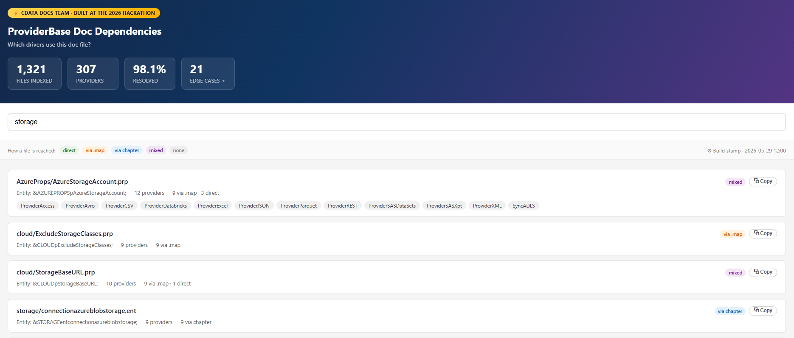
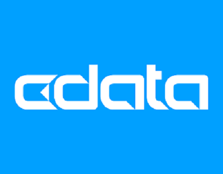
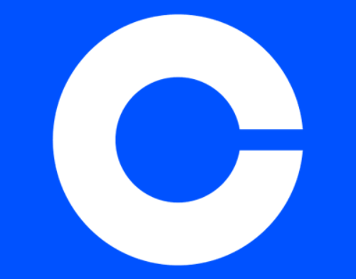
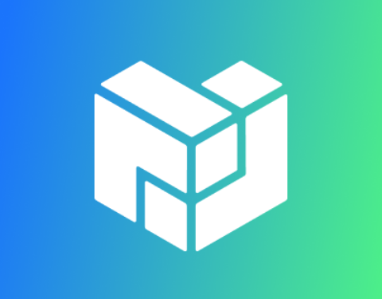
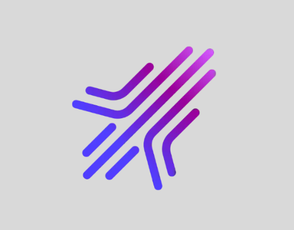
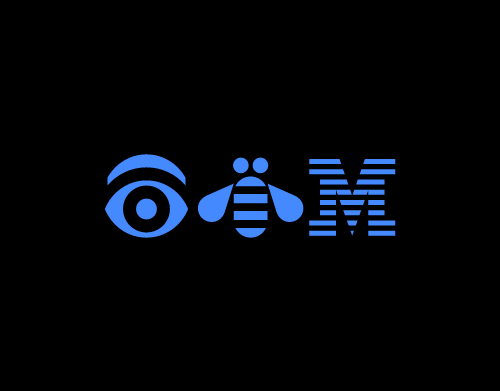

<nav class="site-nav" aria-label="Primary navigation">
  <a class="site-mark" href="#top">SL</a>
  

    <a href="#work">Work</a>
    <a href="#experience">Experience</a>
    <a href="#writing">Writing</a>
    <a href="#about">About</a>
    <a class="nav-resume" href="./assets/Shawn-Lindsey-Resume.pdf">Resume ↗</a>
  

</nav>

<section class="hero" aria-labelledby="hero-title">
  
Technical Writer · Developer Experience

  <h1 id="hero-title">Shawn Lindsey</h1>
  

    I create developer documentation, API content, and documentation systems
    that make complex technical products easier to understand and use.
  

  

    

      Currently
      <strong>CData Software</strong>
    

    

      Focus
      <strong>Developer docs · Docs-as-code · AI workflows</strong>
    

  

  

    <a class="button button-primary" href="#work">View selected work ↓</a>
    <a class="button button-secondary" href="./assets/Shawn-Lindsey-Resume.pdf">View resume ↗</a>
  

</section>

<section id="work" class="section-block">
  

    
Selected work

    
01

  

  <article class="project-feature">
    

      
01 / Documentation systems

      <h2>AI-Assisted Documentation Review Agent</h2>
      

        An AI-assisted documentation workflow designed to improve review consistency,
        reduce repetitive manual checks, and help writers validate changes against
        source material and documentation standards.
      

      

        AI workflows
        Docs-as-code
        Developer experience
      

      <a class="text-link" href="./ai-documentation-agent">Explore project →</a>
    

    
  </article>

  <article class="project-feature">
    

      
02 / Documentation infrastructure

      <h2>Documentation Dependency Resolver</h2>
      

        A Python-based tool for tracing shared documentation dependencies across
        hundreds of product builds, making large-scale documentation changes safer
        and easier to reason about.
      

      

        Python
        Documentation infrastructure
        Docs-as-code
      

      <a class="text-link" href="./driver-documentation-dependency-resolver">Explore project →</a>
    

    
  </article>
</section>

<section id="experience" class="section-block">
  

    
Experience

    
02

  

  

    <article class="experience-row">
      
2024 — Present

      

        <h3>Technical Writer</h3>
        
CData Software

      

      

        Developer documentation for enterprise data connectors, APIs, authentication
        systems, changelogs, and AI-assisted documentation workflows.
      

    </article>

<article class="experience-row">
  
2023 — 2024

  

    <h3>Content Writer</h3>
    
Protocol Labs

  

  

    Technical ecosystem content on emerging Web3 projects, with an emphasis on
    accuracy, editorial consistency, and explaining complex technology clearly.
  

</article>

<article class="experience-row">
  
2021 — 2023

  

    <h3>Lead Editor</h3>
    
Coinbase

  

  

    Content strategy, support documentation, product-launch communications,
    change-management newsletters, audits, and CMS migration work.
  

</article>

<article class="experience-row">
  
2017 — 2021

  

    <h3>Information Developer</h3>
    
Rocket Software

  

  

    API guides, user manuals, release notes, interactive tutorials, UX writing,
    and versioned documentation using Git, DITA, and Markdown.
  

</article>

<article class="experience-row">
  
2016 — 2017

  

    <h3>Information Developer</h3>
    
IBM

  

  

    DITA-based product documentation, release content, UX collaboration, and
    localization-ready documentation for global audiences.
  

</article>

  

</section>

<section id="writing" class="section-block">
  

    
Selected writing

    
03

  

  

    

      
      <h3>CData Software</h3>
    

<a class="writing-row" href="https://cdn.cdata.com/help/FOK/mcp/pg_mcpintro.htm">
  
    <strong>Introduction to MCP</strong>
    <small>Developer onboarding and MCP workflow documentation</small>
  
  ↗
</a>

<a class="writing-row" href="https://cdn.cdata.com/help/BBK/ado/pg_oauthcustomappcreate.htm">
  
    <strong>Creating a Custom OAuth Application</strong>
    <small>OAuth configuration and authentication setup documentation</small>
  
  ↗
</a>

<a class="writing-row" href="https://www.cdata.com/blog/data-hub-vs-data-lake-vs-data-warehouse">
  
    <strong>Data Hub vs. Data Lake vs. Data Warehouse</strong>
    <small>Technical comparison of enterprise data systems</small>
  
  ↗
</a>

  

  

    

      
      <h3>Coinbase</h3>
    

<a class="writing-row" href="https://help.coinbase.com/en/cloud/participate/launch-cluster">
  
    <strong>Launch a Participate Cluster</strong>
    <small>Cloud infrastructure onboarding documentation</small>
  
  ↗
</a>

<a class="writing-row" href="https://help.coinbase.com/en/cloud/participate/manage-cluster">
  
    <strong>Manage your Participate Cluster</strong>
    <small>Developer workflow and operational guidance</small>
  
  ↗
</a>

<a class="writing-row" href="https://docs.cdp.coinbase.com/wallets/demos/demo-app-tutorial">
  
    <strong>Demo App Tutorial</strong>
    <small>End-to-end wallet integration and onboarding tutorial</small>
  
  ↗
</a>

  

  

    

      
      <h3>Protocol Labs</h3>
    

<a class="writing-row" href="https://www.protocol.ai/blog/meet-3box-labs-building-a-web-of-rust-with-data/">
  
    <strong>Building a Web of Trust with Data</strong>
    <small>Technical ecosystem and infrastructure storytelling</small>
  
  ↗
</a>

<a class="writing-row" href="https://protocol.ai/blog/meet-zama-pioneering-the-future-of-encrypted-data/">
  
    <strong>Pioneering the Future of Encrypted Data</strong>
    <small>Emerging technology and encryption-focused content</small>
  
  ↗
</a>

  

  

    
Earlier writing samples +

  

    
    <h3>Rocket Software</h3>
  

  <a class="writing-row" href="https://www3.rocketsoftware.com/bluezone/help/v101/en/bzweb/default.htm">
    
      <strong>Rocket TE Web Administrator Guide</strong>
      <small>Enterprise administration and product documentation</small>
    
    ↗
  </a>

  

    
    <h3>IBM</h3>
  

  <a class="writing-row" href="https://help.hcltechsw.com/domino/9.0.1/admin/admin/over_whats_new_in_fp9.html">
    
      <strong>What’s New in Feature Pack 9</strong>
      <small>Product release and feature documentation</small>
    
    ↗
  </a>
  <a class="writing-row" href="https://help.hcltechsw.com/domino/9.0.1/admin/admin/admn_inline_index_disabling.html">
    
      <strong>Disabling Inline View Indexing</strong>
      <small>Administrative configuration documentation</small>
    
    ↗
  </a>

  

</section>

<section id="about" class="section-block about-grid">
  

    

      
About

      
04

    

    <h2 class="about-title">Documentation at the intersection of product, engineering, and users.</h2>
  

  

    

      I’m a technical writer with 10+ years of experience creating developer
      documentation, API references, release notes, changelogs, and enterprise
      software documentation.
    

    

      My work combines editorial judgment with technical systems thinking:
      Git-based docs-as-code workflows, structured content, developer onboarding,
      and AI-assisted tooling that helps documentation teams work more effectively.
    

  

</section>

<section class="section-block">
  

    
Capabilities

    
05

  

  

    API documentation
    Developer onboarding
    Docs-as-code
    Release notes & changelogs
    Content strategy
    Git / Markdown / DITA
    Python / SQL / Java
    AI-assisted workflows
  

</section>

<section class="section-block">
  

    
Education

    
06

  

  

    

      
2014

      <h3>Northeastern University</h3>
      
Master of Science · Technical and Scientific Communication

    

    

      
2009

      <h3>University of Massachusetts Boston</h3>
      
Bachelor of Arts · English

    

  

</section>

<footer class="site-footer">
  

    
Get in touch

    <h2>Let’s make complex products easier to understand.</h2>
  

  

    <a href="mailto:slindsey001@gmail.com">Email ↗</a>
    <a href="https://www.linkedin.com/in/slindsey001/">LinkedIn ↗</a>
    <a href="./assets/Shawn-Lindsey-Resume.pdf">Resume ↗</a>
  

  
Shawn Lindsey · Technical Writer · Massachusetts, USA

</footer>

