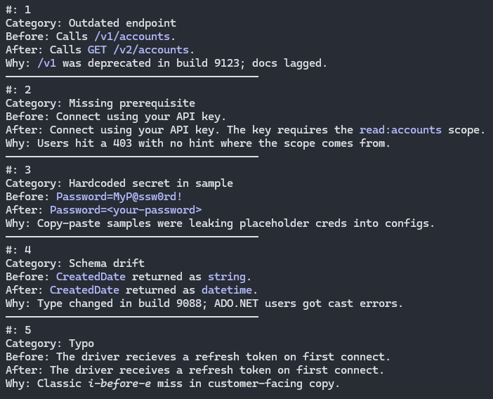

# AI-Assisted Documentation Review Agent

## Overview

Designed a Claude-based documentation agent to support scalable technical writing workflows in a docs-as-code environment.

The project focused on improving documentation consistency, streamlining technical review processes, and exploring how AI-assisted workflows can enhance large-scale documentation operations.

---

## Goals

- Improve documentation consistency
- Streamline technical review workflows
- Reduce manual review overhead
- Integrate Git-aware workflow logic
- Support scalable documentation operations

---

## Responsibilities

- Defined agent behavior and workflow review logic
- Structured markdown-based instruction systems
- Incorporated workflow safeguards and approval flows
- Designed scoped review patterns using Git-based changes
- Focused on scalable documentation processes and maintainability

---

## Example Review Output

Example of structured AI-assisted review output used to identify outdated endpoints, missing prerequisites, schema drift, configuration issues, and documentation inconsistencies during technical review workflows.

---

## Technologies & Concepts

- Claude Agents & Skills
- Markdown
- Git
- Docs-as-Code
- AI-Assisted Review Systems
- Technical Documentation Workflows

---

## Outcome

This project explored practical applications of AI-assisted workflows within technical documentation environments, with an emphasis on scalability, consistency, and developer-focused documentation operations. The workflow concepts and tooling experiments were adopted across the documentation team to help streamline review processes and reduce manual documentation overhead.
